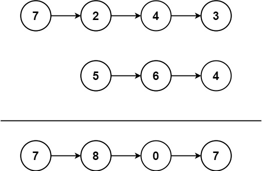

# 445. 两数相加 II
给你两个 非空 链表来代表两个非负整数。数字最高位位于链表开始位置。它们的每个节点只存储一位数字。将这两数相加会返回一个新的链表。

你可以假设除了数字 0 之外，这两个数字都不会以零开头。

示例1：



```javascript
输入：l1 = [7,2,4,3], l2 = [5,6,4]
输出：[7,8,0,7]
```

示例2：

```javascript
输入：l1 = [2,4,3], l2 = [5,6,4]
输出：[8,0,7]
```

示例3：

```javascript
输入：l1 = [0], l2 = [0]
输出：[0]
```

> 提示：

  链表的长度范围为 [1, 100]
  0 <= node.val <= 9
  输入数据保证链表代表的数字无前导 0

进阶：如果输入链表不能修改该如何处理？换句话说，不能对列表中的节点进行翻转。
